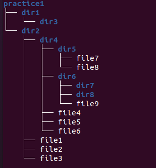

# Завдання 1

За допомогою команд `pwd`, `ls`, `cd`, `touch`, `mkdir` створіть у директорії `/home/ubuntu` директорію `practice1` та всередині неї створіть систему файлів (виділено білим) та директорій (виділено синім), як показано на рисунку нижче, в командах використовуйте відносний шлях до файлів та директорій. Для переміщення по історії команд використовуйте стрілки вгору та вниз.

Перевірте правильність створеної структури файлів та директорії за допомогою команди `tree`.

### Структура файлів та директорій

