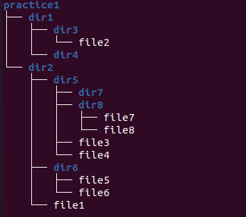

# Завдання 4

За допомогою команд `cp` та `mv` перетворіть директорію **practice1** до показаного нижче на Рис. 2 вигляду (файл **file9** видалено). Командами `touch` та `mkdir` користуватись не можна. Перевірте правильність створеної структури директорій та файлів за допомогою графічного інтерфейсу. Продемонструйте викладачу.

Перевірте правильність створеної структури файлів та директорії за допомогою команди `tree`.

### Структура файлів та директорій

Продемоструйте викладачу.
