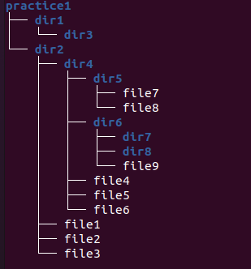

# Завдання 3

Натисніть клавішу Enter декілька разів перед виконанням завдання.

Створіть знову ту саму структуру файлів та директорій, що й в пункті 1. В командах використовуйте абсолютний шлях до файлів та директорій. При цьому шлях повинен починатися або з кореневої директорії (/), або з домашньої директорії вашого користувача (~). Команду cd використовувати не слід. При введенні шляхів використовуйте клавішу Tab для автодоповнення команд.

Перевірте правильність створеної структури файлів та директорії за допомогою команди `tree`.

### Структура файлів та директорій

Продемоструйте викладачу.
