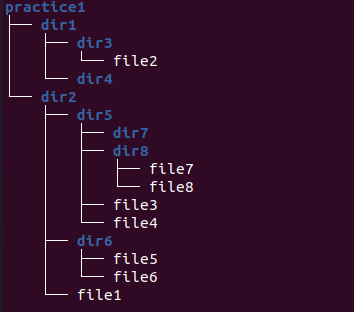

# Завдання 4

Натисніть клавішу Enter кілька разів перед виконанням завдання.

Видаліть файл **file9** із вищеописаної структури файлів та директорій. За допомогою команд `cp` та `mv` перетворіть директорію **practice1** до показаного нижче на Рис. 2 вигляду. Командами `touch` та `mkdir` не користуватись. 

Перевірте правильність створеної структури файлів та директорії за допомогою команди `tree`.

Продемоструйте викладачу.
