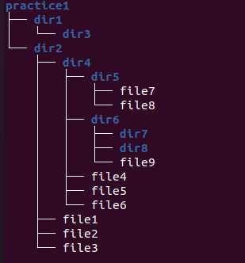

# Завдання 4

Натисніть клавішу Enter кілька разів перед виконанням завдання.

Створіть ту саму структуру файлів та директорій, що й в пункті 2 (див. малюнок). В командах використовуйте абсолютний шлях до файлів та директорій. Шлях повинен починатися з кореневої директорії (/) або з домашньої директорії (~). Команду cd не використовуйте. При введенні шляхів використовуйте клавішу Tab для автодоповнення.

Перевірте правильність створеної структури файлів та директорії за допомогою команди `tree`.

Продемонструйте викладачу.
