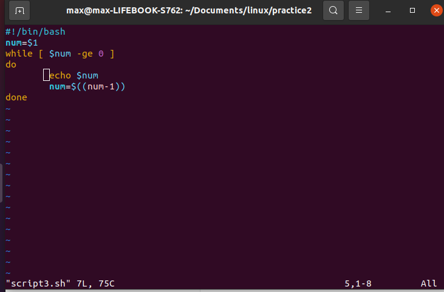

# Завдання 3

Зараз ви знаходитесь у vim в нормальному режимі. Для вводу тексту в нормальному режимі перейдіть до режиму вставки, для цього слід натиснути клавішу i, після переходу до цього режиму внизу вікна з’явиться надпис -- INSERT --.

Якщо натискання клавіш не приводить до друкування відповідних символів – ви потрапили до іншого режиму, спочатку поверніться до нормального режиму натисканням клавіші Esc , знову ввійдіть до режиму вставки, натиснувши i, та продовжіть введення тексту. Після закінчення вводу тексту вийдіть із vim зі збереженням змін командою :wq (перед введенням команди поверніться до нормального режиму натисканням клавіші Esc) та введіть ім'я зберігаємого файлу script3.sh. Потім виконайте у терміналі команду chmod u+x script3.sh. Спробуйте виконати новостворений скрипт командою ./script3.sh. Що трапилось ? Спробуйте творіть виконати новостворений скрипт з різними аргументами: рядок, число, різна кількість аргументів. В якому випадку скрипт працює, а в якому видає помилку ? 

Продемонструйте викладачу.
