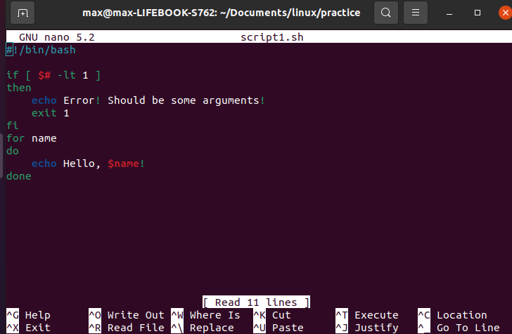

# Завдання 1

Створіть файл `script1.sh` та напишіть в цьому файлі вказаний на малюнку код за допомогою nano (кольорове оформлення коду nano створює автоматично). Після цього збережіть файл з кодом, вийдіть із nano та виведіть вміст файлу на екран за допомогою `cat`. Виконайте команду `chmod u+x script1.sh` та запустіть скрипт декілька разів на виконання командою `./script1.sh` , при цьому вказуйте різну кількість аргументів (0, 1, 2, 3), розділених пропусками. Що робить даний скрипт ? 

Продемоструйте викладачу.
