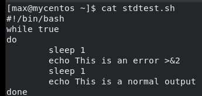

# Завдання 2

Створіть файл stdtest.sh з наступним текстом

Зробіть файл виконуваним на запустіть його. При цьому на екран почергово будуть виводитись рядки “This is an error” та “This is normal output”. Ці рядки відповідають стандартному потоку помилок та стандартному потоку виводу, відповідно. За замовчуванням ці потоки спрямовано на екран, але це можна змінити. Перервіть виконання програми комбінацією клавіш **Ctrl+C**.
