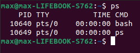

Команда ps виводе інформацію про процеси, пов’язані з поточним терміналом. Після виконання команди ps у новому ви отримаєте інформацію про 2 процеси: оболонку bash та процес виконання цієї ж команди ps. При цьому PID – ідентифікатор процесу, TTY – термінал, CMD — команда.

