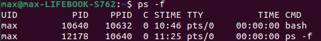

При використанні опції -f команда ps виводе більш докладну інформацію про процес, зокрема додаються ім’я користувача, що запустив процес, та PID батьківського процесу. При використанні опції -e виводиться інформація про всі процеси в системі.

