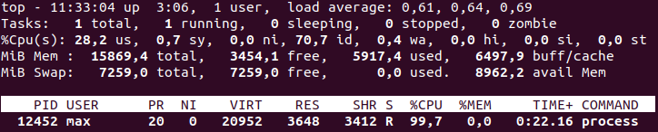

jobs — виводе перелік завдань, запущених у поточному терміналі.
Команда bg (fg) %n переводе завдання із номером n у фоновий (інтерактивний) режим.
Команда top виводить інформацію про поточний стан системи та процеси, що виконуються.

