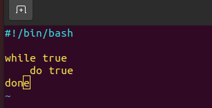

# Завдання 1

Створіть файл process наступного вмісту (див. малюнок). Зробіть цей файл таким, що 
може виконуватися. 
    a) Виконайте команду ps -f, чому дорівнює PID вашої оболонки ? У вашій домашній директорії в каталозі practice5 створіть файл командою echo "-----------a----------" > proc_res. Запишіть PID оболонки до файлу командою echo PID of the shell is ? >> proc_res (тут замість знаку питання запишіть PID вашої оболонки). 

