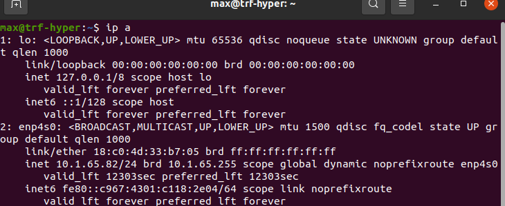
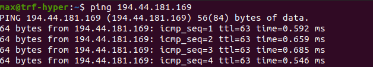

# Завдання 3

Виконайте команду ip a (приклад див. на малюнку нижче), в результаті ви побачите інформацію про наявні на вашому комп’ютері мережеві інтерфейси. Для зображеного на малюнку прикладу ми маємо два інтерфейси 1: lo (це localhost-інтерфейс), 2: enp4so (це робочій мережевий інтерфейс, на ньому комп’ютер має ір-адресу 10.1.65.82). Вам треба визначити назву робочого мережевого інтерфейсу вашого комп’ютера, наразі це enp4s0.

Перевірте доступність якоїсь ір-адреси командою ping 194.44.181.169 (можна спробувати іншу ір-адресу). Ви побачите щось подібне на зображений нижче малюнок.

Перервіть виконання команди ping комбінацією клавіш Ctrl + C. Тепер запустіть таку ж команду ping спрямувавши її stdout до нульового пристрою. При нормальній роботі мережі на екрані ви нічого не побачите. Відкрите ще одну копію терміналу, залогіньтесь там від імені користувача ubuntu за допомогою команди su і вимкніть ваш робочий мережевий інтерфейс за допомогою команди sudo ip link set enp4s0 down . Після виконання цієї команди у першому терміналі повинні з’явитися повідомлення про помилки. Увімкніть ваш робочий мережевий інтерфейс командою sudo ip link set enp4s0 up. Спрямуйте до нульового пристрою обидва потоки stdout та stderr, що в цьому випадку відбувається після вимкнення робочого мережевого інтерфейсу? Увімкніть ваш робочий мережевий інтерфейс та закрийте додатковий термінал. У першому терміналі перервіть виконання команди ping комбінацією клавіш Ctrl + C. 
